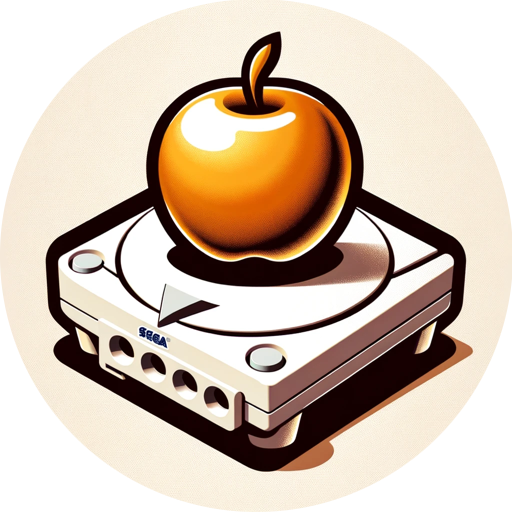

  
  <h3 align="center">KallistiOS ChatGPT</h3>

Is a custom tailored version of ChatGPT to be more helpful for programming for the Sega Dreamcast using KallistiOS.

## Instructions

"instructions.txt" contains the instructions I feed into the Instruction section when configuring this GPT.

## Knowledge

"KALLISTIOS.pdf" is the pdf form of https://kos-docs.dreamcast.wiki/index.html that I added to the knowledge section.

For more info about creating GPTs: https://openai.com/blog/introducing-gpts
